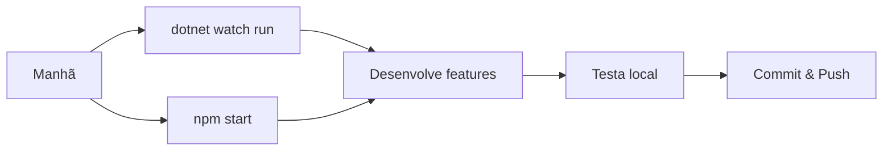
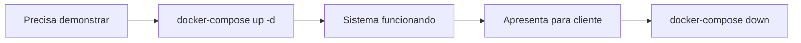

# 🚀 Guia Prático de Desenvolvimento - Sistema MDFe

## 📋 Índice
- [Como Executar o Sistema](#-como-executar-o-sistema)
- [Quando Usar Cada Modo](#-quando-usar-cada-modo)
- [Cenários Práticos](#-cenários-práticos)
- [Comandos Essenciais](#-comandos-essenciais)
- [Troubleshooting](#-troubleshooting)

---

## 🎯 Como Executar o Sistema

### **Modo 1: Desenvolvimento Tradicional** (Recomendado para dia a dia)

#### **🔧 Backend (.NET API):**
```bash
# Na pasta backend (renomeado de MDFe.Api)
cd backend
dotnet run
```
**Resultado:** API rodando em `http://localhost:5000` ou `https://localhost:5001`

#### **🌐 Frontend (React):**
```bash
# Na pasta frontend (terminal separado)
cd frontend
npm start
```
**Resultado:** React rodando em `http://localhost:3000`

#### **🗄️ Banco de Dados:**
- Usa seu **SQL Server local** (que você já tem configurado)
- Connection string em `appsettings.json`

---

### **Modo 2: Docker Completo** (Para deploy/demonstrações)

```bash
# Na raiz do projeto
docker-compose up -d
```

**Resultado:**
- 🗄️ **SQL Server:** `localhost:14333`
- 🔧 **API:** `http://localhost:8080`
- 🌐 **Frontend:** `http://localhost:3000`

---

## 🤔 Quando Usar Cada Modo

### **📅 Desenvolvimento Diário - Use Modo Tradicional**

| **Situação** | **Por que usar Tradicional** |
|--------------|-------------------------------|
| **Coding normal** | ✅ Debugging mais fácil no Visual Studio |
| **Modificar banco** | ✅ Acesso direto ao SQL Server Management Studio |
| **Testar APIs** | ✅ Hot reload automático com `dotnet watch` |
| **Modificar frontend** | ✅ Hot reload instantâneo do React |
| **Performance** | ✅ Zero overhead de containers |

**Exemplo prático:**
```bash
# Manhã de segunda-feira, vou desenvolver uma nova feature
cd MDFe.Api
dotnet watch run  # Auto-reload quando mudar código

cd frontend
npm start  # Auto-reload do React
```

---

### **🎭 Demonstrações - Use Docker**

| **Situação** | **Por que usar Docker** |
|--------------|--------------------------|
| **Cliente quer ver** | ✅ Sistema completo em 30 segundos |
| **Apresentação** | ✅ Não depende de configuração local |
| **Ambiente limpo** | ✅ Dados "zerados" para demonstração |
| **Notebook diferente** | ✅ Funciona em qualquer máquina |

**Exemplo prático:**
```bash
# Cliente vem às 14h para ver o sistema
docker-compose up -d
# ✅ Pronto! Sistema funcionando em localhost:3000
```

---

### **🚀 Deploy Produção - Use Docker**

| **Situação** | **Por que usar Docker** |
|--------------|--------------------------|
| **Servidor novo** | ✅ Setup automático |
| **AWS/Azure** | ✅ Compatibilidade garantida |
| **Backup/Restore** | ✅ Volumes organizados |
| **Escalabilidade** | ✅ Pode aumentar instâncias |

---

## 🎬 Cenários Práticos

### **Cenário 1: "Vou desenvolver uma nova tela"**
```bash
# ✅ Use Modo Tradicional
cd frontend
npm start

cd MDFe.Api  
dotnet watch run

# Por que? Hot reload, debugging fácil, performance máxima
```

### **Cenário 2: "Cliente quer ver a nova funcionalidade"**
```bash
# ✅ Use Docker
docker-compose up -d

# Por que? Setup rápido, ambiente limpo, confiável
```

### **Cenário 3: "Novo desenvolvedor na equipe"**
```bash
# ✅ Primeiro uso: Docker (para ver funcionando)
git clone projeto
docker-compose up -d
# "Nossa, que legal! Funciona!"

# ✅ Depois: Modo Tradicional (para desenvolver)
# Configura SQL Server local, Visual Studio, etc.
```

### **Cenário 4: "Vou debuggar um bug complexo"**
```bash
# ✅ Use Modo Tradicional
# Abre Visual Studio
# F5 ou F10 para debuggar linha por linha
# Breakpoints, inspect variables, etc.

# ❌ Docker seria ruim aqui (debugging mais difícil)
```

### **Cenário 5: "Preciso testar com dados limpos"**
```bash
# ✅ Use Docker
docker-compose down  # Para tudo
docker-compose up -d  # Sobe com banco zerado

# Por que? Banco novo, sem dados "sujos" de desenvolvimento
```

---

## ⚡ Comandos Essenciais

### **🔧 Desenvolvimento Tradicional**

```bash
# Backend com auto-reload
cd backend
dotnet watch run

# Frontend com auto-reload
cd frontend
npm start

# Migrations (quando mudar Models)
dotnet ef migrations add NomeDaMigracao
dotnet ef database update

# Limpar build
dotnet clean
dotnet build
```

### **🐳 Docker**

```bash
# Subir todos os serviços
docker-compose up -d

# Ver logs em tempo real
docker-compose logs -f

# Ver logs só da API
docker-compose logs -f api

# Parar tudo
docker-compose down

# Rebuild (após mudanças no código)
docker-compose up --build -d

# Entrar no container SQL
docker exec -it mdfesql /bin/bash

# Backup do banco Docker
docker exec mdfesql /opt/mssql-tools/bin/sqlcmd -S localhost -U sa -P 'Your_strong_password123' -Q "BACKUP DATABASE SistemaModelo TO DISK = '/var/opt/mssql/backup.bak'"
```

---

## 🚦 Fluxo de Trabalho Recomendado

### **📅 Segunda a Sexta (Desenvolvimento):**


### **🎯 Demonstrações/Deploy:**


---

## 🔍 Como Saber Qual Usar?

### **🤔 Faça estas perguntas:**

| **Pergunta** | **Tradicional** | **Docker** |
|--------------|-----------------|------------|
| Vou modificar código? | ✅ | ❌ |
| Vou debuggar? | ✅ | ❌ |
| Preciso de performance máxima? | ✅ | ❌ |
| Vou mostrar para alguém? | ❌ | ✅ |
| Preciso de setup rápido? | ❌ | ✅ |
| É deploy em servidor? | ❌ | ✅ |
| Quero ambiente limpo? | ❌ | ✅ |

---

## 🆘 Troubleshooting

### **🔧 Problemas Modo Tradicional**

#### **Erro: "Connection refused SQL Server"**
```bash
# ✅ Solução: Verificar se SQL Server está rodando
services.msc  # Windows Services
# Procurar "SQL Server" e iniciar

# Ou verificar connection string em appsettings.json
```

#### **Erro: "Port 5000 already in use"**
```bash
# ✅ Solução: Matar processo na porta
netstat -ano | findstr :5000
taskkill /PID {PID_NUMBER} /F
```

#### **Erro: "npm start not working"**
```bash
# ✅ Solução: Reinstalar dependências
cd frontend
rm -rf node_modules
npm install
npm start
```

### **🐳 Problemas Docker**

#### **Erro: "Docker not found"**
```bash
# ✅ Solução: Instalar Docker Desktop
# Download: https://www.docker.com/products/docker-desktop
```

#### **Erro: "Port 8080 already in use"**
```bash
# ✅ Solução: Parar outros containers
docker-compose down
docker ps  # Ver containers rodando
docker stop {CONTAINER_ID}
```

#### **Erro: "SQL Server container won't start"**
```bash
# ✅ Solução: Verificar logs
docker-compose logs sqlserver

# Geralmente é falta de memória RAM
# SQL Server precisa de pelo menos 2GB
```

---

## 📊 Comparação Rápida

| **Aspecto** | **Tradicional** | **Docker** |
|-------------|-----------------|------------|
| **Setup inicial** | 🐌 30-60 min | ⚡ 2-5 min |
| **Desenvolvimento** | ⚡ Muito rápido | 🐌 Mais lento |
| **Debugging** | ⚡ Excelente | 🐌 Limitado |
| **Demonstrações** | 🐌 Depende da máquina | ⚡ Sempre funciona |
| **Deploy** | 🐌 Complexo | ⚡ Simples |
| **Performance** | ⚡ Nativa | ➡️ 95% da nativa |
| **Consumo RAM** | ➡️ Médio | 🐌 Alto |

---

## 🎯 Resumo Final

### **📝 Regra de Ouro:**

```
🔧 DESENVOLVENDO = Modo Tradicional
🎭 DEMONSTRANDO = Docker
🚀 DEPLOYANDO = Docker
🐛 DEBUGGANDO = Modo Tradicional
⚡ PERFORMANCE = Modo Tradicional
🧹 AMBIENTE LIMPO = Docker
```

### **💡 Dica Pro:**

**Use os dois!** Não são excludentes:

1. **Desenvolva** no modo tradicional (rápido, debugging fácil)
2. **Teste** no Docker antes de mostrar (garantia que funciona)
3. **Demonstre** com Docker (setup rápido, confiável)
4. **Deploy** com Docker (padronizado, escalável)

---

## 🏃‍♂️ Quick Start

### **Primeira vez:**
```bash
# 1. Ver funcionando (Docker)
docker-compose up -d
# Abrir http://localhost:3000

# 2. Configurar desenvolvimento (Tradicional)
# - Instalar .NET 8
# - Instalar Node.js
# - Configurar SQL Server local
# - Configurar Visual Studio/VS Code

# 3. Desenvolver (Tradicional)
dotnet watch run & npm start
```

### **Já configurado:**
```bash
# Desenvolvimento normal
cd backend
dotnet watch run  # Terminal 1
cd ../frontend
npm start         # Terminal 2

# Demonstração rápida
docker-compose up -d
```

---

**🎉 Agora você sabe exatamente quando usar cada modo! Happy coding! 🚀**
